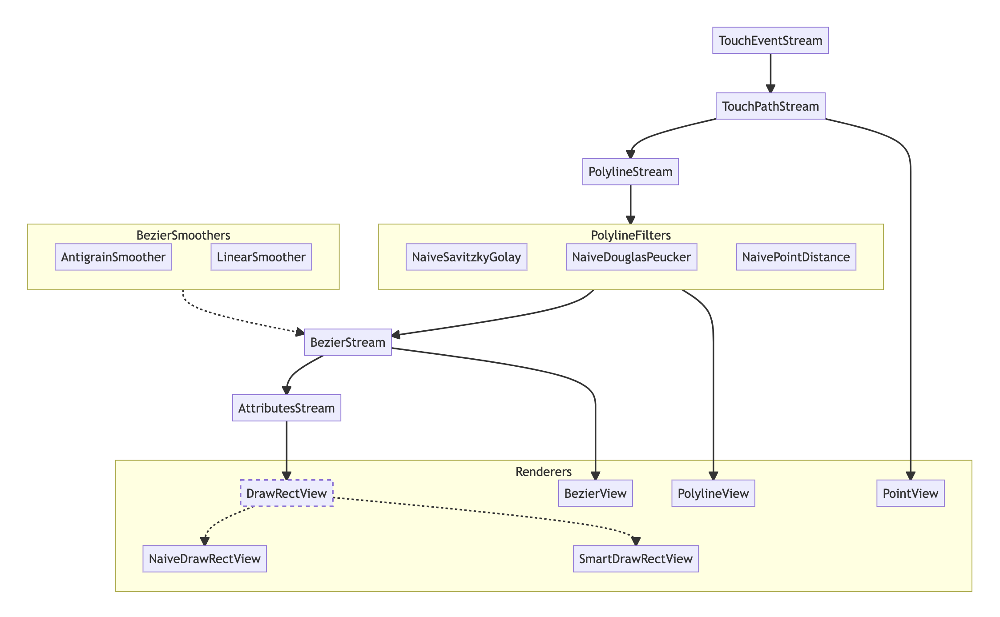

# Inkable
 
## Data Flow chart
 
The flow chart below describes how UITouch events are processed into Bezier paths. The code is extremely modular
allowing for easy customization at any point of the algorithm. The output at any step of the process can be
filtered and modified before sending it to the next step. For an example, see the `NaiveSavitzkyGolay` and other
Polyline filters. 
 
 <a href='https://adamwulf.github.io/Inkable/'>View the chart with tooltips here</a>.
 
 <a href='https://adamwulf.github.io/Inkable/'></a>
 
Since `UITouch` information can arrive faster than a gesture recognizer can process and callback
with the touch information, the `UITouches` are sent to the gesture recognizer in batches through
a variety of methods on the `UIGestureRecognizer` subclass. `Inkable` simplifies processing these
touch events by providing a single callback to process the entire batch of `UITouch` data.
Further, the event stream is then processed through `Streams` into points, polylines, and finally
bezier curves.

This `Stream` architecture allows computation to be cached at every step of the process, so that an
entire `UIBezierPath` does not need to be recomputed each time a new `UITouch` event arrives. Instead,
only the minimal amount of work is computed and the cached path is updated, allowing for extremely
efficient `UIBezierPath` building.

## Example

First, create a `TouchStream` and add its gesture recognizer to a `UIView`. All events from the gesture
recognizer will automatically be processed by the `TouchStream` without any additional work.

```swift
let touchStream = TouchStream()
myView.addGestureRecognizer(touchStream.gesture)
```

Next, build the processing pipeline for your events. Each step is optional, depending on what sorts
of paths you want to generate. Below will generate smooth `UIBezierPath` output

```swift
// create a stream to convert `TouchPaths` to `Polylines`
let lineStream = PolylineStream()
// create a stream to convert `Polylines` to `UIBezierPath`
let bezierStream = BezierStream(smoother: AntigrainSmoother())
// setup the streams to consume the previous step's output
touchPathStream.addConsumer(lineStream)
lineStream.addConsumer(bezierStream)
// add a `block` to inspect the final output
bezierStream.addConsumer { (output) in
    let beziers: [UIBezierPath] = output.paths
    // use the bezier paths
    let changes: [BezierStream.Delta] = output.deltas
    // inspect how the paths changed since the last callback
}
```

The above pipeline will:

1. process all `UITouches`/updates/predictions into `TouchPaths`
2. process those `TouchPaths` into `Polylines`
3. process those `Polylines` into `UIBezierPaths`
4. send those `UIBezierPaths` to the consumer block at the end of the pipeline

Any new touch event will immediatley be processed by the entire pipeline, with each step
only doing the minimum computation needed and relying on its cache whenever possible.

You can add `block` consumers to any step to inspect its output. Each Stream can support
an arbitrary number of consumers.

## Funnel

### 1. Touch Events (class)

UITouches come in a few types:
 - new data about a new touch
 - updating estimated data about an existing touch
 - predicted data about a future touch

`UITouch` information arrives through `UIGestureRecognizers`, which provide information about
new touches, `coalesced` touches (which also provide updated information about previous touches),
and `predicted` touches.

The `TouchEventGestureRecognizer` creates `TouchEvent` objects for every incoming `UITouch`.
These can be serialized to json, so that raw touch data can be replayed. This serialization
makes reproducing specific ink behavior much easier, as users can export their raw touch data
and it can be loaded and replayed in development or inside of unit tests.
 
### 2. Touch Paths (class)

The `TouchPathStream` processes all of the `TouchEvents` and separates them into `TouchPath`s.
Each `TouchPath` represents one finger or Pencil on the iPad, and all of the events associated
with that finger are collected into a single `TouchPath.Point`. Also, since many UITouches
may represent the same moment in time (a predicted touch, the actual touch with estimated data,
and updates to the touch with more accurate data), the `TouchPath` will also coalesce all
matching events into a single `TouchPoints.Point` object.

`TouchPath` also tracks if an update is still expected for the touch, either because the phase
is not yet `.ended` or because an existing `.Point` is still expecting more accurate data to
arrive as an updated event. If any event is still expected, `isComplete` will be `false`
regardless of the `phase`.

`TouchPaths` are objects, and hold references to each `UITouch` for each generated `TouchPath.Point`.


### 3. PolyLine (struct)

The `PolylineStream` creates `Polyline`s to wrap the `TouchPath` and `TouchPath.Point` in structs
so that they can be processed by value in filters. This way each Polyline Filters can hold a copy
of its input, and any modified data will be insulated from other filters modifications. This makes
caching inside of the filters much more straight forward than using the reference type `TouchPath`.

`Polyline`s are essentially just value-types of the `TouchPath` reference type.


### 4. Polyline Filters

Filters are an easy way to transform the `PolylineStream.Output` with any modification. For instance,
a Savitzky-Golay filter will smooth the points together, modifying their location attributes of the
`Polyline.Point`s. A Douglas-Peucker filter will remove points that are colinear with their
neighboring points.

These filters are a way for the dense Polyline output of the original Polyline stream to be simplified
before being smoothed into Bezier paths, resulting in similar looking bezier paths with far fewer
elements.


### 5. Beziers

The BezierStream processes `PolylineStream` output into `UIBezierPaths`. This stream takes a `Smoother`
as input, which affects how the input poly-line is converted into bezier path curve elements. The
simple `LineSmoother` converts the `Polyline` directly into a `UIBezierPath` made entirely of `lineTo`
elements. The `AntigrainSmoother` converts the `Polyline` into smoother `curveTo` elements.


### 6. Tapered Strokes (TBD)

This will convert single-width stroked-path beziers into variable-width filled-path beziers.


## TODO

Next steps:

1. [x] Unit tests for existing Steps 1, 2
2. [x] Ability to save/load json files containing touch event data
3. [x] Unit tests for `TouchPathStream`
4. [x] Unit tests for `PolylineStream`
4. [x] Unit tests for `BezierStream`
5. [x] Create UIBezierPath cubic smoothing
7. [x] Example app showing the stream of events and the output from each step
8. [ ] Add list of `TouchPath.Points` to the Example app
9. [ ] Allow encode/decode of arbitrary `DrawEvent` subclass instead of only `TouchEvent`

### Smoothing:

- [x] SmoothStroke model for generating fixed-width UIBezierPaths
- [ ] SmoothStroke model for generating variable-width UIBezierPaths


### Renderers:

- [x] Basic CGContext rendering
       - with and without background image
- [x] naive DrawRect
- [x] smarter DrawRect
- [ ] CAShapeLayer
- [ ] CAShapeLayer with flattened cache 
- [ ] SceneKit (git@github.com:adamwulf/SKDraw.git)


### Filters:

- [x] Implement naive SavitzkyGolay smoothing
- [ ] Implement optimized SavitzkyGolay smoothing
- [ ] Implement naive DouglasPeucker filtering
- [ ] Implement optimized DouglasPeucker filtering
- [ ] Implement naive DistanceThinning filtering
- [ ] Implement optimized DistanceThinning filtering


## Inspiration

The code is a Swift rewrite and successor to [DrawUI](https://github.com/adamwulf/DrawUI). Its
[archived objective-c branch](https://github.com/adamwulf/DrawUI/tree/archived/objective-c) contains
features that will likely show up here at some point.
 
## Support
 
Has Inkable saved you time? Become a [Github Sponsor](https://github.com/sponsors/adamwulf) and buy me a coffee ☕️ 😄
