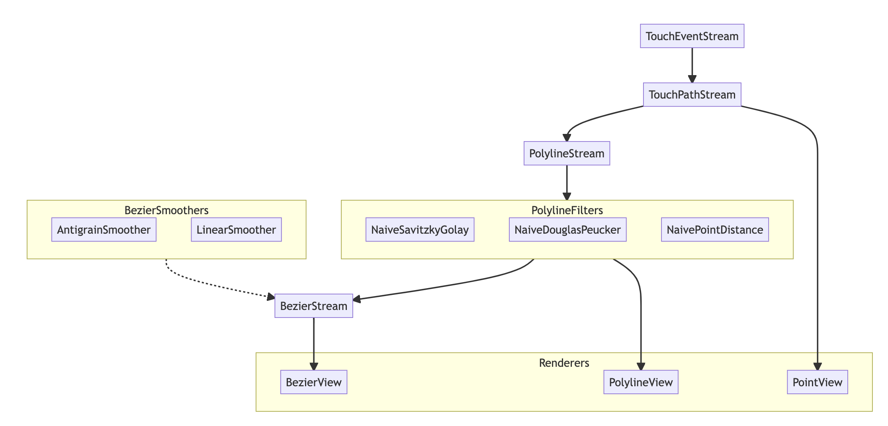

# Inkable
 
## Data Flow chart
 
The flow chart below describes how UITouch events are processed into Bezier paths. The code is extremely modular
allowing for easy customization at any point of the algorithm. 
 
 <a href='https://adamwulf.github.io/Inkable/'>View the chart with tooltips here</a>.
 
 

## Funnel

### 1. Touch Events (class)

UITouches come in a few types:
 - new data about a new touch
 - updating estimated data about an existing touch
 - predicted data about a future touch
 
Additionally, UITouches can contain `coalesced` touch information about multiple UITouch
events of higher precision.
 
Further, touches come in batches, both adding new touch points and updating/predicting
other touch points.
 
The `TouchEventGestureRecognizer` creates `TouchEvent` objects for every incoming `UITouch`.
These can be serialized to json, so that raw touch data can be replayed. This serialization
makes reproducing specific ink behavior much easier, as users can export their raw touch data
and it can be loaded and replayed in development or inside of unit tests.
 
### 2. Touch Paths (class)

The `TouchPathStream` processes all of the `TouchEvents` and separates them into `TouchPath`s.
Each `TouchPath` represents one finger or Pencil on the iPad, and all of the events associated
with that finger are collected into a single `TouchPath.Point`. Also, since many UITouches
may represent the same moment in time (a predicted touch, the actual touch with estimated data,
and updates to the touch with more accurate data), the `TouchPath` will also coalesce all
matching events into a single `TouchPoints.Point` object.

`TouchPath` also tracks if an update is still expected for the touch, either because the phase
is not yet `.ended` or because an existing `.Point` is still expecting more accurate data to
arrive as an updated event. If any event is still expected, `isComplete` will be `false`
regardless of the `phase`.

### 3. PolyLine (struct)

The `PolylineStream` creates `Polyline`s to wrap the `TouchPath` and `TouchPath.Point` in structs
so that they can be modified by filters without modifying the underlying data. This way each
Smoothing Filter can hold a copy of its input, and any modified data will be insulated from other
filters modifications. This makes caching inside of the filters much more straight forward.

`Polyline`s are essentially mutable versions of `TouchPath`

### 4. Polyline Filters

Filters are an easy way to transform the `PolylineStream.Output` with any modification. For instance,
a Savitzky-Golay filter will smooth the points together, modifying their location attributes of the
`Polyline.Point`s. A Douglas-Peucker filter will remove unecessarly points that are colinear with
their neighboring points.

These filters are a way for the dense Polyline output of the original Polyline stream to be simplified
before being smoothed into Bezier paths.

### 5. Smooth Strokes (TBD)

The StrokeStream will convert a `Polyline` into a Bezier modelled `Stroke`.

### 6. Tapered Strokes (TBD)

This will convert single-width stroked-path beziers into variable-width filled-path beziers.

### 7. Clipped Strokes (TBD)

This will take Tapered Strokes and calculate their clipped difference with an input eraser stroke

## TODO

Next steps:

1. [x] Unit tests for existing Steps 1, 2
2. [x] Ability to save/load json files containing touch event data
3. [x] Unit tests for existing Step 3
4. [ ] Unit tests for existing Step 4
5. [x] Create UIBezierPath cubic smoothing
6. [x] implement CGContextRenderer
7. [x] Implement a UIView that uses the context renderer for its drawing
8. [ ] implement background rendering to image
9. [ ] implement background rendering to vector PDF

### Smoothing:

- [x] SmoothStroke model for generating fixed-width UIBezierPaths
- [ ] SmoothStroke model for generating variable-width UIBezierPaths

### Renderers:

The below should also implement undo/redo

- [x] Basic CGContext rendering
       - with and without background image
- [x] naive DrawRect
- [x] smarter DrawRect
- [ ] CAShapeLayer
- [ ] CAShapeLayer with flattened cache 
- [ ] SceneKit (git@github.com:adamwulf/SKDraw.git)

### Filters:

- [x] Implement naive SavitzkyGolay smoothing
- [ ] Implement optimized SavitzkyGolay smoothing
- [ ] Implement naive DouglasPeucker filtering
- [ ] Implement optimized DouglasPeucker filtering
- [ ] Implement naive DistanceThinning filtering
- [ ] Implement optimized DistanceThinning filtering

## Inspiration

The code is a Swift rewrite and successor to [DrawUI](https://github.com/adamwulf/DrawUI). Its
[archived objective-c branch](https://github.com/adamwulf/DrawUI/tree/archived/objective-c) contains
features that will likely show up here at some point.
 
## Support
 
Has Inkable saved you time? Become a [Github Sponsor](https://github.com/sponsors/adamwulf) and buy me a coffee ☕️ 😄
